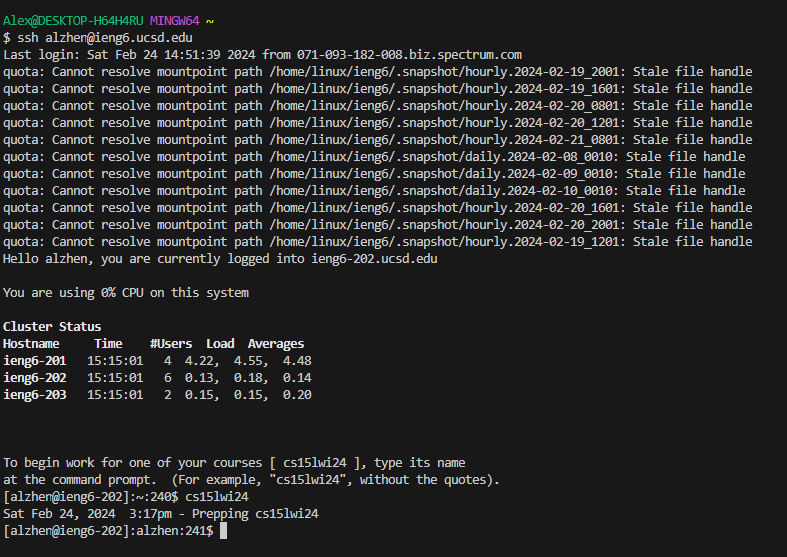
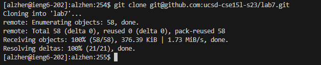
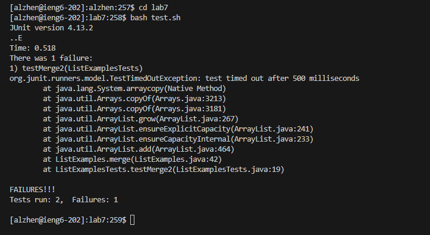
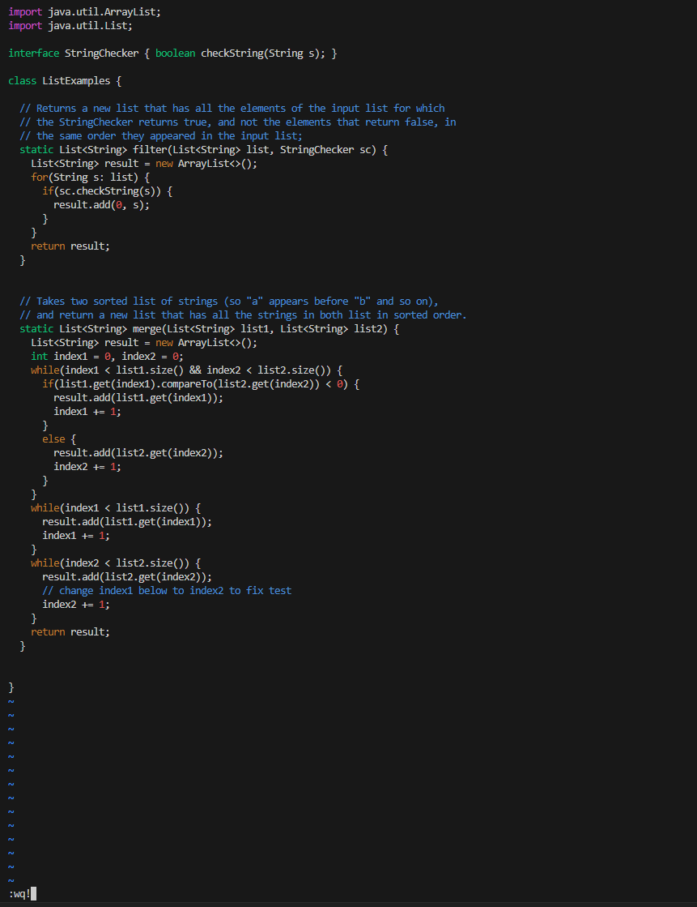
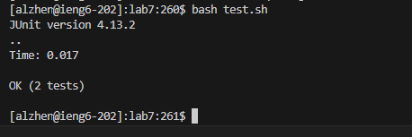

# Lab Report 4 - Alexander Zhen

4. Log into ieng6

> Keys pressed: I typed out `ssh alzhen@ieng6.ucsd.edu` and then pressed `<enter>`. Then I typed in `cs15lwi24` then pressed `<enter>`.

5. Clone your fork of the repository from your Github account (using the `SSH` URL)

> Keys pressed: I typed out `git clone`, then I pressed `<ctrl>` and `v` to paste the `SSH` URL clone `git@github.com:ucsd-cse15l-s23/lab7.git` and pressed `<enter>`.

6. Run the tests, demonstrating that they fail

> Keys pressed: I typed out `cd lab7` then pressed `<enter>`. Then, typed out `bash test.sh` and pressed `<enter>`. 

7. Edit the code file to fix the failing test

> Keys pressed: I typed out `vim ListExamples.java` then pressed `<enter>`. Then, I pressed `<shift>` and `g` to get to the last line of the code. After, I pressed `k`,`k`,`k`,`k`,`k`,`k` (6 times) to go up to the line that contained `index1 += 1`. Then, I pressed `<ctrl>` and `a` to increment the nearest numerical value on that line, which was the `1` on `index1`, which incremented it to `index2` to fix the code. Then I typed out `:wq!` to save and exit vim and pressed `<enter>`

8. Run the tests, demonstrating that they now succeed

> Keys pressed: I typed out `bash test.sh` and then pressed `<enter>`.

9. Commit and push the resulting change to your Github account (you can pick any commit message!)

