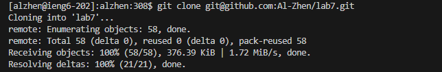
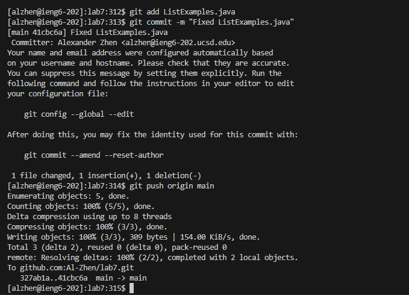

# CSE 15L - Lab Report 4 - Alexander Zhen

4. Log into ieng6

> Keys pressed: I typed out `ssh alzhen@ieng6.ucsd.edu` and then pressed `<enter>`. Then I typed in `cs15lwi24` then pressed `<enter>`, in order to connect my personal computer to the CSE basement.

5. Clone your fork of the repository from your Github account (using the `SSH` URL)

> Keys pressed: I typed out `git clone`, then I pressed `<ctrl>` and `v` to paste the `SSH` URL clone `git@github.com:Al-Zhen/lab7.git` and pressed `<enter>`.

6. Run the tests, demonstrating that they fail

> Keys pressed: I typed out `cd lab7` then pressed `<enter>` to change to the correct directory. Then, typed out `bash`, `<space>`, then `t`, `<tab>` to get `test.sh` and pressed `<enter>` to run the test. 

7. Edit the code file to fix the failing test

> Keys pressed: I typed out `vim ListExamples.java` then pressed `<enter>` to open up `ListExamples.java` via the Vim text editor. Then, I pressed `<shift>` and `g` to get to the last line of the code. After, I pressed `k`,`k`,`k`,`k`,`k`,`k` (6 times) to go up to the line that contained `index1 += 1`. Then, I pressed `<ctrl>` and `a` to increment the nearest numerical value on that line, which was the `1` on `index1`, which incremented it to `index2` to fix the code. Then I typed out `:wq!` to save and exit vim and pressed `<enter>`

8. Run the tests, demonstrating that they now succeed

> Keys pressed: I typed out `bash` , `<sapce>` , `t` , `tab` to get `test.sh` and then pressed `<enter>`.

9. Commit and push the resulting change to your Github account (you can pick any commit message!)

> Keys pressed: I typed out `git add "ListExamples.java"` and pressed `<enter>` to add `ListExamples.java` to the staging area in my Git repository. Then I typed out `git commit -m "Fixed ListExamples.java"` and pressed `<enter>` to create a commit on my Git repository and a message to specify the commit. After, I typed out `git push origin main` and pressed `<enter>` to take the changes made in `ListExamples.java` and 'pushes' it back to GitHub. 
